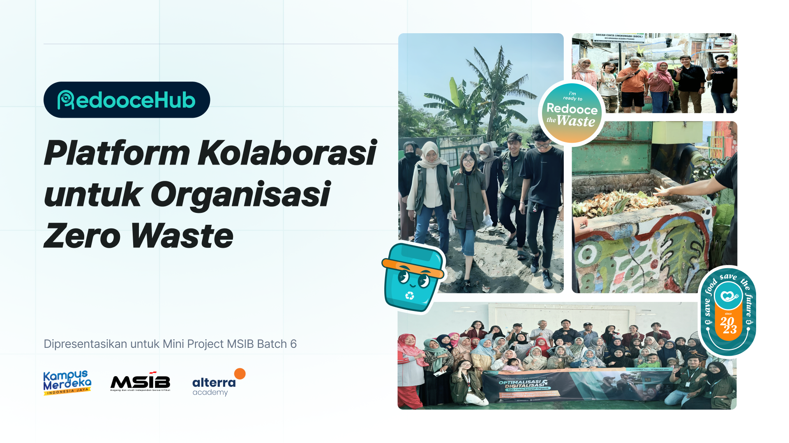
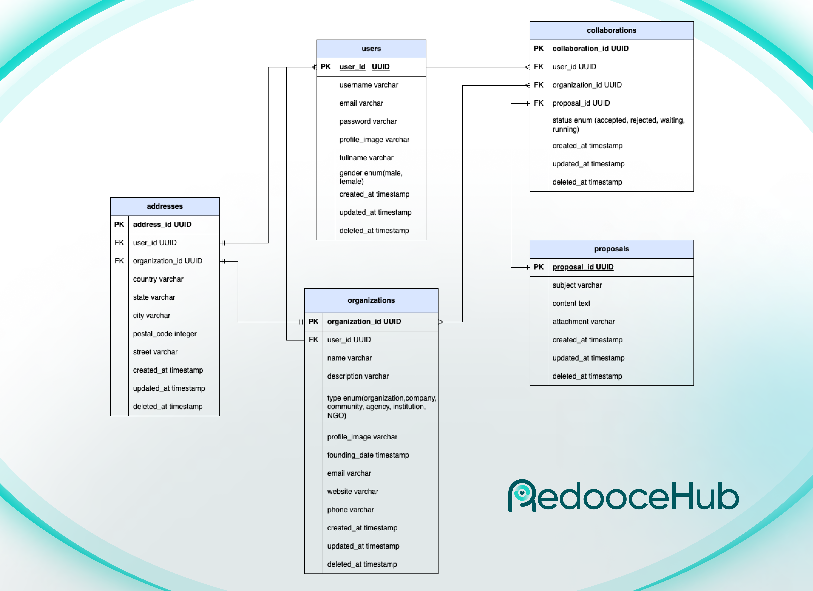
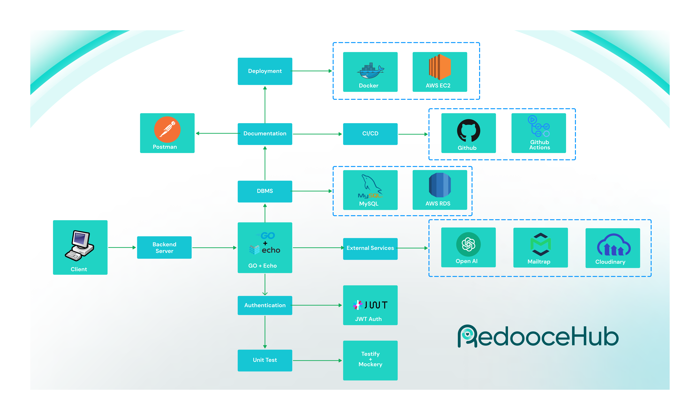

# Redooce Hub

## About Project

Redooce Hub, sebuah aplikasi yang digunakan sebagai wadah organisasi, lembaga, atau individu untuk berkolaborasi dalam berbagai kegiatan yang berfokus pada penanganan masalah sampah atau zero waste.

## Features
Hanya terdapat satu role yaitu user:
### Autentikasi
- Register
- Login
- Dashboard
- Edit Profile
- Manage Address

### Collab Hub
- Manage Organisasi
- Manage Address
- Kirim Proposal
- Kelola Proposal

## Tech Stacks
Aplikasi dibangun menggunakan clean architecture dan beberapa stack seperti:
- **Framework**: Echo
- **Database**: MySQL
- **ORM**: GORM
- **Deployment**: AWS EC2 & RDS
- **Container**: Docker
- **Authentication**: JWT
- **Version Control**: Github
- **CI/CD**: Github Actions
- **Unit Test**: testify, mockery
- **Other Services**: Open AI, Mailtrap, Cloudinary
- **API Documentation**: Postman

## Documents
### API Docs
https://documenter.getpostman.com/view/9643281/2sA3JT1xQ1 
### ERD

### HLA

### Slide
lorem ipsum

## Prerequisite
### Open AI
1. Dari dashboard OpenAI, navigasi ke bagian **API Keys**.
2. Klik tombol **Create new secret key** atau **Generate new key**.
3. Beri nama API key Anda, lalu klik **Create** atau **Generate**.
4. Salin API key pada `.env` bagian `OPENAI_API_KEY=`.

### Cloudinary
1. Dari dashboard Cloudinary, navigasi ke bagian **Dashboard**.
2. Di sana, Anda akan menemukan informasi **Cloud Name**, **API Key**, dan **API Secret** di bawah bagian **Account Details**.
3. lalu salin ke `.env`
```
CLOUDINARY_CLOUD_NAME=your_cloud_name_here
CLOUDINARY_API_KEY=your_api_key_here
CLOUDINARY_API_SECRET=your_api_secret_here
```

### Mailtrap
1. Dari dashboard Mailtrap, navigasi ke tab **Inboxes**.
2. Pilih atau buat inbox baru.
3. Klik pada nama inbox untuk membuka detailnya.
4. Di tab **SMTP Settings**, Anda akan menemukan informasi konfigurasi SMTP, termasuk **SMTP server**, **port**, **username**, dan **password**.
5. Lalu salin ke `.env`
```
MAILTRAP_HOST=smtp.mailtrap.io
MAILTRAP_PORT=2525
MAILTRAP_USER=your_mailtrap_username_here
MAILTRAP_PASSWORD=your_mailtrap_password_here
```

## Run Local
### Clone Repository
```
git clone https://github.com/Nafidinara/ZeroWasteCollaboration.git
```
### Navigate to the project directory
```
cd ZeroWasteCollaboration
```

### Copy the .env.example file to .env
```
cp .env.example .env
```

### Install dependencies
```
go mod tidy
```

### Run The application
```
go run cmd/main.go
```

## Run With Docker
```
docker compose up -d
```